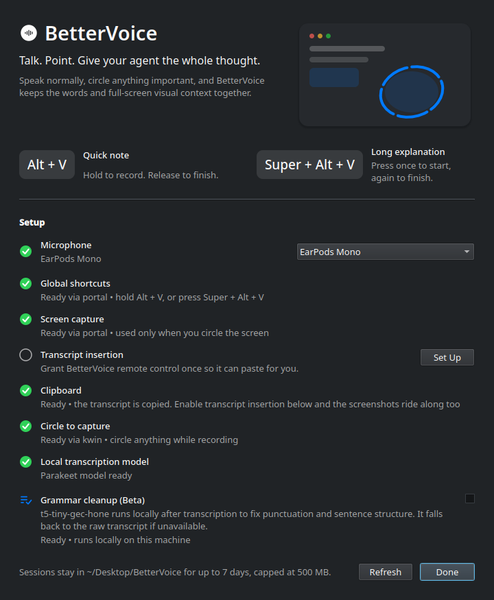
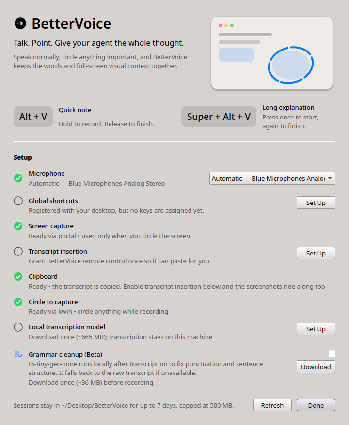

# BetterVoice for Linux

Voice dictation with the screen context you point at — a native Linux port of the
[BetterVoice](README.md) macOS menu-bar app.

BetterVoice lives in your system tray. Hold a shortcut and talk; it transcribes
locally and types the result into whatever field you were already using. While
you talk, circle anything on screen with the pointer and BetterVoice captures
that display with a blue highlight around what you referenced, so the words and
the picture arrive together.

Nothing is uploaded. Transcription, grammar cleanup and screen capture all run on
your machine.



## Use it

- Hold **Alt + V** for a quick note. Recording starts after a short hold and
  finishes when you release.
- Press **Super + Alt + V** for a long explanation. Press it again to finish.
- A soft cue from your sound theme confirms when listening starts and stops.
- While recording, circle any important UI with the pointer. A blue trail follows
  your movement and a pulse confirms each capture.
- BetterVoice pastes the transcript into the focused text field. Long
  explanations also leave the transcript on the clipboard; quick notes put your
  previous clipboard back.

Sessions are written to `~/Desktop/BetterVoice/` as a `context.md` next to its
screenshots, and are pruned after seven days or 500 MB, whichever comes first.

> On X11, and on Wayland where BetterVoice can read input devices directly, the
> shortcuts are the bare modifiers the macOS build used — **hold Alt**, and
> **Super+Alt** to toggle. On a standard Wayland session the compositor will not
> report a bare modifier, so the defaults become the chords above. See
> [Shortcuts](#shortcuts).

## Install

Requirements: a Linux desktop with PipeWire or PulseAudio, Python 3.11+, and
about 1 GB of disk for the local speech model.

```bash
git clone https://github.com/TarunTomar122/better-voice.git
cd better-voice
./install.sh
```

The installer creates a virtual environment under
`~/.local/share/BetterVoice/venv`, installs a `bettervoice` launcher into
`~/.local/bin`, and registers the desktop entry and icon. Registering the desktop
entry matters: it is how the XDG portals identify BetterVoice when it asks for
global shortcuts and screen capture.

If you would rather install from a wheel, the desktop entry ships inside the
package and BetterVoice can register itself:

```bash
pip install --user bettervoice
bettervoice --install-desktop-entry
```

Then start it from your application menu, or:

```bash
bettervoice
```

To check what BetterVoice picked for each part of your system:

```bash
bettervoice --doctor
```

To start it at login:

```bash
systemctl --user enable --now app-io.github.taruntomar122.BetterVoice.service
```

### Distribution packages

The installer only needs Python, but a few optional packages make BetterVoice
work better. On Fedora:

```bash
sudo dnf install wl-clipboard wtype pipewire-utils espeak-ng
```

On Debian/Ubuntu:

```bash
sudo apt install wl-clipboard wtype pipewire-bin
```

Only `wl-clipboard` really matters, and only on Wayland — see
[The clipboard on Wayland](#the-clipboard-on-wayland). `bettervoice --doctor`
says what each one affects.

## First run

Open **Getting Started…** from the tray icon. It shows the live state of
everything BetterVoice depends on:

| Row | What it means |
| --- | --- |
| **Microphone** | Which input is used. *Automatic* prefers a connected external microphone, then your system default. |
| **Global shortcuts** | Which backend supplies the shortcuts, and whether keys are assigned. |
| **Circle to capture** | Whether BetterVoice can follow the pointer for circle gestures. |
| **Screen capture** | Which backend takes the screenshots. |
| **Clipboard** | Whether the transcript can reach the clipboard, and whether screenshots ride along. |
| **Transcript insertion** | Whether BetterVoice can paste into the focused field. |
| **Local transcription** | The Parakeet model — download it once (~665 MB). |
| **Grammar cleanup (Beta)** | The optional local grammar model (~36 MB). |



The local model must finish downloading before the first recording. Everything
else degrades rather than blocks: without screen capture you still get
transcripts, without transcript insertion the text still reaches your clipboard.

## Shortcuts

Wayland compositors do not let an application watch the keyboard, so BetterVoice
asks the desktop for its shortcuts through
`org.freedesktop.portal.GlobalShortcuts`. Two consequences:

1. The defaults are chords (**Alt+V**, **Super+Alt+V**) rather than bare
   modifiers, because a compositor will not report `Alt` on its own.
2. Some desktops — KDE Plasma among them — register the shortcuts but leave the
   keys unassigned until you pick them. BetterVoice says so in **Getting
   Started…** and the **Assign keys** button opens your desktop's shortcut
   editor, where BetterVoice appears with its two entries.

You can rebind them there at any time; the compositor owns the binding, not
BetterVoice.

### Getting the original hold-Alt behaviour

If you want exactly what the macOS build did — hold `Alt`, add `Super` mid-hold
to promote a quick note into a long one — BetterVoice can read the modifier keys
directly. This is opt-in rather than automatic: reading `/dev/input` only covers
the keyboards *your user* can open, and watching some but not all of them looks
like it works right up until you type on the wrong one. BetterVoice checks the
kernel's device table and says so in **Getting Started…** when that is the case.

It needs permission to read input devices:

```bash
sudo usermod -aG input "$USER"
```

Log out and back in, then set the backend explicitly in
`~/.config/BetterVoice/settings.json`:

```json
{ "hotkeyBackend": "evdev" }
```

On an X11 session this works with no extra permissions at all — BetterVoice polls
the X server's modifier state and picks the `x11` backend automatically.

## What you get on your desktop

BetterVoice picks a backend per capability, so what it can do depends on the
session. `bettervoice --doctor` reports the actual choices; this is what to
expect:

| | KDE Wayland | GNOME Wayland | wlroots (Sway…) | X11 |
| --- | --- | --- | --- | --- |
| Shortcuts | portal | portal | `evdev`¹ | Xlib |
| Circle to capture | KWin | — ² | `evdev`¹ | Xlib |
| Screen capture | portal | portal | portal or `grim` | `maim`/`import` |
| Transcript insertion | portal | portal | `wtype` | `xdotool` |
| Paste target remembered | yes | no | no | no |

¹ Needs your user in the `input` group; see [Getting the original hold-Alt
behaviour](#getting-the-original-hold-alt-behaviour).
² Wayland hides the pointer and GNOME has no equivalent of the KWin script, so
circle-to-capture is unavailable; dictation is unaffected.

Recording and transcription work on all of them — only the extras vary.

## How each piece maps to Linux

The macOS build leaned on frameworks that have no Linux equivalent, so each one
became a small interface with several implementations. BetterVoice picks the best
available for your session and tells you which in `--doctor`.

| macOS | Linux |
| --- | --- |
| `NSStatusItem` menu bar | `QSystemTrayIcon` (StatusNotifierItem on KDE/GNOME) |
| `AVAudioEngine` + CoreAudio | PipeWire/PulseAudio via PortAudio, routed per-stream with `PIPEWIRE_NODE` |
| FluidAudio Parakeet (CoreML) | The same Parakeet TDT 0.6B model in ONNX, on onnxruntime |
| `ScreenCaptureKit` | `org.freedesktop.portal.Screenshot`, or `grim` / `spectacle` / `gnome-screenshot` |
| `NSEvent` modifier monitoring | `org.freedesktop.portal.GlobalShortcuts`, `/dev/input` via evdev, or Xlib |
| `CGEvent` pointer location | KWin's `workspace.cursorPos` over D-Bus, `XQueryPointer`, or evdev motion |
| Accessibility API paste | `org.freedesktop.portal.RemoteDesktop`, or `wtype` / `ydotool` / `xdotool` |
| Frontmost-app capture for the paste target | KWin reports and restores the active window |
| `NSPanel` overlays at screen-saver level | One fullscreen, input-transparent Qt window per screen |
| `NSPasteboard` with text and images together | The Clipboard portal when granted, else `wl-copy` on Wayland; Qt's multi-format offer on X11 |
| `NSSound` system sounds | The freedesktop sound theme through libcanberra, with synthesised fallbacks |
| `UserDefaults` | `~/.config/BetterVoice/settings.json` |
| `.app` bundle | Desktop entry, icon, launcher and an optional systemd user service |

The parts that are pure logic — the circle-gesture detector, the shortcut state
machine, the retention and completion policies, the trail segmentation — are
ported line for line from `Sources/BetterVoiceCore`, and their tests came across
with them.

### The clipboard on Wayland

Wayland only lets an application claim the clipboard while it holds a recent
input serial, and BetterVoice never has one — it is a tray app driven by global
shortcuts. The `wlr-data-control` protocol exists for this case, and `wl-copy`
speaks it, which is why **wl-clipboard is the one package worth installing**.
Without it BetterVoice cannot reliably put the transcript anywhere but the saved
session.

That protocol serves one MIME type per selection, so on its own Wayland gets the
transcript and leaves the screenshots in the session folder, referenced from
`context.md`.

BetterVoice checks that your compositor actually implements the protocol rather
than assuming it because `wl-copy` is installed — GNOME, for one, has not always
offered it — and **Getting Started…** says so plainly if it does not.

There is a way to get the full macOS behaviour back. Once you enable **transcript
insertion**, BetterVoice holds a remote-desktop session with your compositor, and
`org.freedesktop.portal.Clipboard` can then offer every format at once — plain
text, rich text with the screenshots inline, the file URIs, and the first image.
BetterVoice uses that path whenever the session is granted and falls back to
`wl-copy` when it is not.

On X11 Qt can claim the selection unprompted, so the full set always goes out.
**Getting Started…** says which of the three you are getting.

### Where the transcript lands

Transcription takes a moment, and on a slow machine you might have moved to
another window by the time it finishes. The macOS build handled this by
remembering the frontmost application when recording stopped and sending the
paste there.

On KDE, BetterVoice does the same: a KWin script reports the active window when a
recording ends and brings it back just before pasting. Elsewhere the paste goes
to whatever holds focus at that moment. Either way BetterVoice refuses to paste
into its own windows — the transcript stays on the clipboard instead.

### Pointer tracking on Wayland

Following a circle you draw anywhere on screen needs the pointer position, which
Wayland does not give applications. On KDE, BetterVoice loads a small KWin script
that reads `workspace.cursorPos` and hands it back over D-Bus — the compositor
does the reading, so no extra permissions are involved, and the position is
exact. The script is loaded only while recording and unloaded afterwards.

On other Wayland compositors, add yourself to the `input` group (as above) and
BetterVoice integrates raw pointer motion instead. That estimate ignores your
pointer acceleration curve, so the highlight can drift; **Getting Started…** says
so when that backend is in use. It also checks the kernel's device table and
tells you if only *some* of your pointing devices are readable — otherwise
tracking would simply stop whenever you used one of the others. Without either, recording and transcription work
normally and only the circle gesture is unavailable.

## Settings

`~/.config/BetterVoice/settings.json` is plain JSON and safe to edit by hand.

| Key | Default | Meaning |
| --- | --- | --- |
| `selectedMicrophoneName` | `null` | A specific PipeWire source, or `null` for automatic |
| `grammarCorrectionEnabled` | `false` | Run the local grammar model on each transcript |
| `hotkeyBackend` | `"auto"` | `auto`, `portal`, `evdev`, `x11`, `none` |
| `focusBackend` | `"auto"` | `auto`, `kwin`, `none` — how the paste target is remembered |
| `hotkeyBackend` note | | `evdev` is never chosen automatically; ask for it by name |
| `pointerBackend` | `"auto"` | `auto`, `kwin`, `x11`, `evdev`, `none` |
| `screenshotBackend` | `"auto"` | `auto`, `portal`, `grim`, `spectacle`, `gnome-screenshot`, `maim`, `import`, `x11`, `none` |
| `textInsertionBackend` | `"auto"` | `auto`, `portal`, `wtype`, `ydotool`, `xdotool`, `none` |
| `silenceThreshold` | `0.015` | Recordings quieter than this never reach the model; `0` disables the check |
| `soundCuesEnabled` | `true` | Play the start/stop cues |
| `reduceMotion` | `"auto"` | `auto` follows your desktop's animation setting; `true`/`false` override it |
| `asrModel` | `"nemo-parakeet-tdt-0.6b-v2"` | Also accepts `nemo-parakeet-tdt-0.6b-v3` (multilingual) and `whisper-base` |
| `asrQuantization` | `"int8"` | `int8` for the small download, or `null` for the full-precision export |

Set `BETTERVOICE_SESSIONS_DIR` to put saved sessions somewhere other than
`~/Desktop/BetterVoice`. Set `BETTERVOICE_NO_SCOPE=1` to stop the launcher
wrapping BetterVoice in its own systemd scope — the autostart unit already does
this, because the unit is that cgroup.

BetterVoice follows your desktop's reduced-motion preference through
`org.freedesktop.portal.Settings`, and notices when you change it, so the tray
pulse and capture animation stop without a restart.

## If something is not working

Start with `bettervoice --doctor` — it prints which backend each part chose and
why anything unavailable is unavailable.

- **The shortcut does nothing.** Open **Getting Started…**. If the shortcuts row
  says no keys are assigned, press **Assign keys**. Confirm the model row says
  ready, and that only one BetterVoice is running.
- **No screenshot.** The first capture asks your desktop for permission. If you
  declined, clear the decision in your desktop's application-permission settings
  and press **Test capture** in **Getting Started…**.
- **The transcript is not inserted.** Press **Enable** on the transcript-insertion
  row and allow the request, or install `wtype` (Wayland) or `xdotool` (X11). The
  transcript stays on the clipboard and in the saved session either way.
- **Circle gestures do nothing.** Check the circle-to-capture row; see
  [Pointer tracking on Wayland](#pointer-tracking-on-wayland).
- **The wrong microphone.** Choose it under **Microphone** in the tray menu.
- **Model download failed.** Reopen **Getting Started…** and press **Download**
  again; partial files are re-verified rather than re-fetched.
- **A short recording vanished.** A session under 2.5 seconds with no speech and
  no circles is discarded quietly. Longer empty sessions are saved without an
  error.
- **Very quiet speech was ignored.** Speech recognisers invent a word or two out
  of near-silence, so a recording whose loudest moment stays below
  `silenceThreshold` is treated as empty rather than transcribed — otherwise an
  accidental shortcut press would paste a stray "Yeah." into whatever you were
  typing. Digital silence measures `0.0` and ordinary speech peaks around `0.85`
  on that scale, so the `0.015` default has a wide margin; lower it, or set it to
  `0`, if your microphone is unusually quiet.

## Development

```bash
python3 -m venv .venv
.venv/bin/pip install -e '.[dev]'
.venv/bin/pytest                       # everything that needs no desktop
BETTERVOICE_INTEGRATION=1 .venv/bin/pytest tests/test_integration.py
.venv/bin/ruff check bettervoice tests
```

The integration tests need a live desktop session. Those that photograph the
screen skip themselves when it is locked, rather than failing in ways that look
like transcription or storage bugs.

The lint rules are chosen for correctness rather than style — `pyproject.toml`
records which families are on and why the unused-argument ones are off (Qt hands
paint and event handlers arguments they do not use, so those fire constantly
without ever indicating a problem).

The integration test needs a live desktop session and the downloaded model. It
records real audio through a temporary null sink, draws a circle for the gesture
detector, takes a real screenshot, and checks the resulting session folder.

## Uninstall

```bash
./uninstall.sh
```

That removes the launcher, desktop entry, icon and service. Add `--purge` to also
delete the downloaded models, settings and saved sessions.

## Privacy and storage

- Transcription runs locally through [Parakeet TDT](https://huggingface.co/istupakov/parakeet-tdt-0.6b-v2-onnx) on onnxruntime.
- Grammar cleanup, when enabled, runs locally through [`t5-tiny-gec-hone`](https://huggingface.co/rabden/t5-tiny-gec-hone), pinned by revision and verified by SHA-256.
- Models live in `~/.local/share/BetterVoice/`; settings in `~/.config/BetterVoice/`; sessions on your Desktop.
- Recordings are written to `$XDG_RUNTIME_DIR/BetterVoice/` and deleted as soon as they are transcribed. Files left behind by a crash are cleaned up at the next start.

## License

MIT, the same as the upstream project. See [LICENSE](LICENSE).
